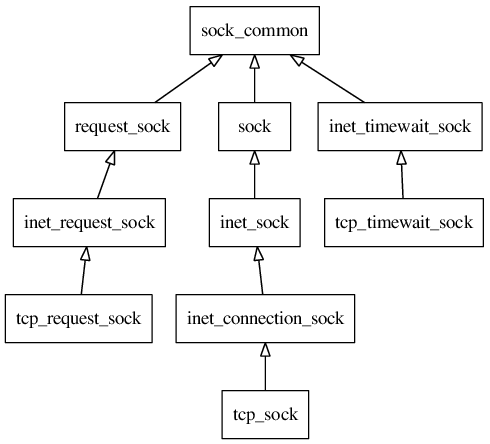
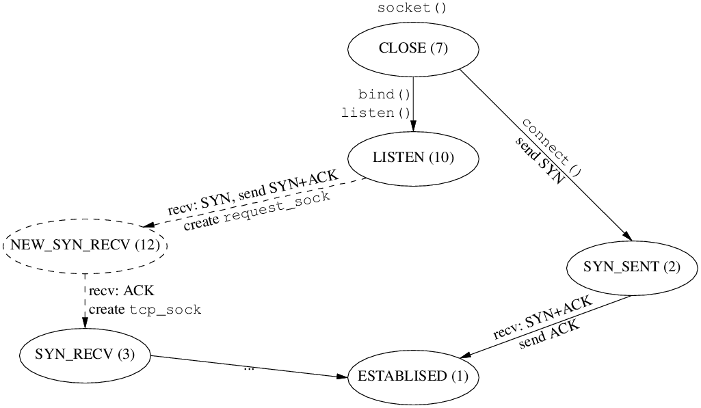
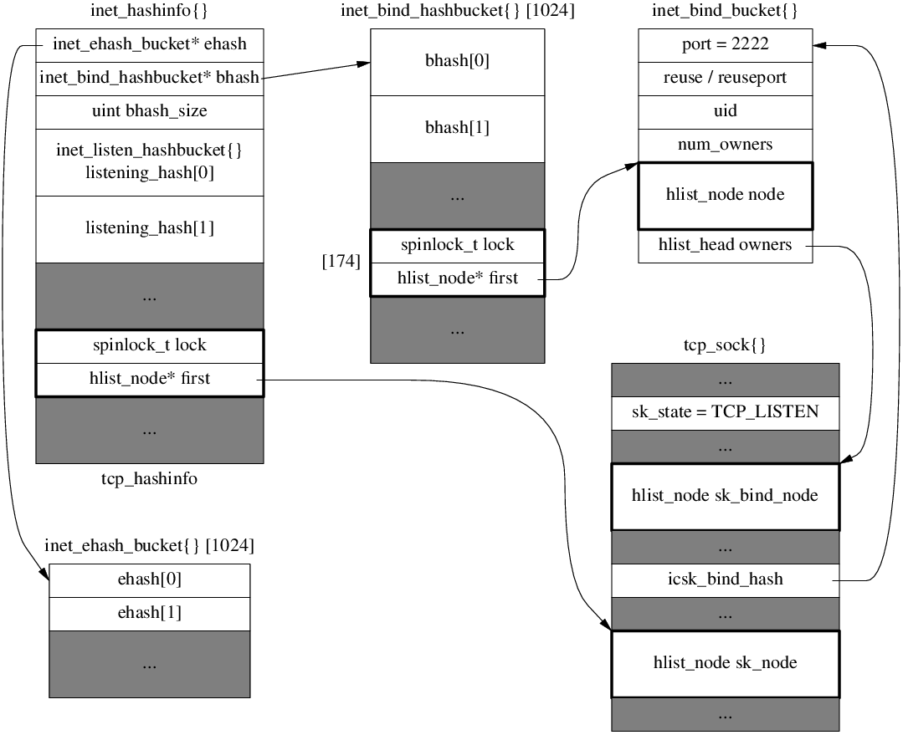
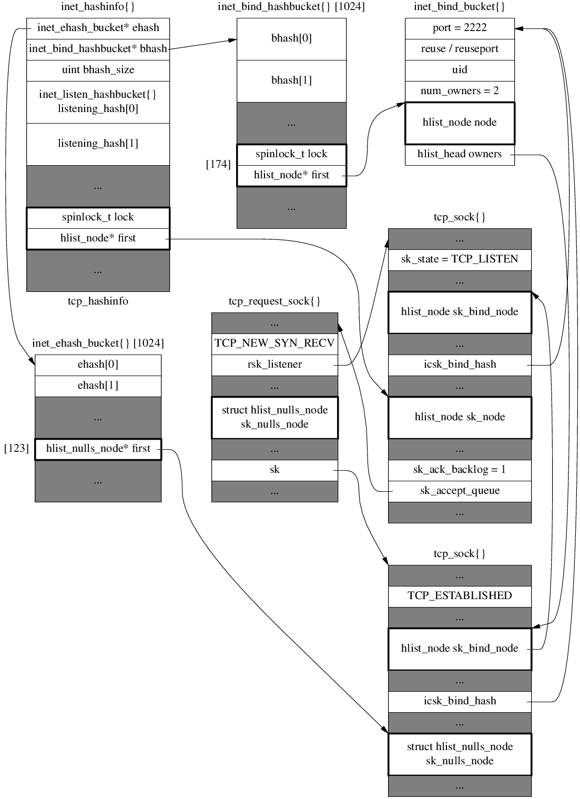

# `tcp_sock`



# `tcp_hashinfo`

```c
// include/linux/types.h
struct hlist_head {
        struct hlist_node *first;
};

struct hlist_node {
        struct hlist_node *next, **pprev;
};

// include/linux/list_nulls.h
struct hlist_nulls_head {
        struct hlist_nulls_node *first;
};

struct hlist_nulls_node {
        struct hlist_nulls_node *next, **pprev;
};

// include/net/inet_hashtables.h
struct inet_ehash_bucket {
        struct hlist_nulls_head chain;
};

struct inet_bind_hashbucket {
        spinlock_t              lock;  // empty
        struct hlist_head       chain;
};

struct inet_listen_hashbucket {
        spinlock_t              lock;  // empty
        struct hlist_head       head;
};

#define INET_LHTABLE_SIZE       32      /* Yes, really, this is all you need. */

struct inet_hashinfo {
        /* This is for sockets with full identity only.  Sockets here will
         * always be without wildcards and will have the following invariant:
         *
         *          TCP_ESTABLISHED <= sk->sk_state < TCP_CLOSE
         *
         */
        struct inet_ehash_bucket        *ehash;
        spinlock_t                      *ehash_locks;
        unsigned int                    ehash_mask;
        unsigned int                    ehash_locks_mask;

        /* Ok, let's try this, I give up, we do need a local binding
         * TCP hash as well as the others for fast bind/connect.
         */
        struct inet_bind_hashbucket     *bhash;

        unsigned int                    bhash_size;
        /* 4 bytes hole on 64 bit */

        struct kmem_cache               *bind_bucket_cachep;

        /* All the above members are written once at bootup and
         * never written again _or_ are predominantly read-access.
         *
         * Now align to a new cache line as all the following members
         * might be often dirty.
         */
        /* All sockets in TCP_LISTEN state will be in here.  This is the only
         * table where wildcard'd TCP sockets can exist.  Hash function here
         * is just local port number.
         */
        struct inet_listen_hashbucket   listening_hash[INET_LHTABLE_SIZE]
                                        ____cacheline_aligned_in_smp;
};

```

# TCP state diagram in Linux 4.4+


# `bind`
```text
sys_bind
  -> inet_bind
    -> inet_csk_get_port
      -> goto have_snum:
      -> goto tb_not_found:  tb == NULL
        -> inet_bind_bucket_create
      -> goto success:
        -> inet_bind_hash
          -> sk_add_bind_node
  -> fput_light
// tcp_hashinfo.bhash -> inet_bind_hashbucket -> inet_bind_bucket[port=2222] -> tcp_sock
```

# `listen`
```text
sys_listen
  -> inet_listen
    -> inet_csk_listen_start
      -> reqsk_queue_alloc
      -> inet_csk_delack_init
      -> set sk->sk_state = TCP_LISTEN
      -> inet_csk_get_port
        -> goto have_snum:
        -> goto tb_found:
          -> inet_csk_bind_conflict
        -> goto tb_not_found:  tb != NULL
      -> inet_hash
        -> __inet_hash  // tcp_hashinfo.listening_hash[X] add node
```

After bind() and listen()


# Passive open

## Receive SYN
```
tcp_v4_rcv
  -> __inet_lookup_skb
    -> __inet_lookup
      -> __inet_lookup_established
      -> __inet_lookup_listener  // found

  -> tcp_v4_do_rcv  // sk_state == TCP_LISTEN
    -> tcp_rcv_state_process
      -> tcp_v4_conn_request  // icsk->icsk_af_ops->conn_request
        -> tcp_conn_request
          -> req = inet_reqsk_alloc
            -> reqsk_alloc
               req->rsk_listener = sk_listener;
            ireq->ireq_state = TCP_NEW_SYN_RECV;
            ireq->ireq_family = sk_listener->sk_family;
          -> tcp_parse_options
          -> tcp_openreq_init
          -> tcp_v4_init_req  // af_ops->init_req
            -> tcp_v4_save_options
          -> isn = tcp_v4_init_sequence  // af_ops->init_seq
          -> tcp_v4_route_req  // af_ops->route_req
            -> inet_csk_route_req
              -> flowi4_init_output
              -> ip_route_output_flow
          -> tcp_ecn_create_request
          -> tcp_openreq_init_rwin
            -> tcp_select_initial_window
          -> tcp_reqsk_record_syn
          -> tcp_try_fastopen
          -> inet_csk_reqsk_queue_hash_add
            -> reqsk_queue_hash_req  //***
              -> inet_ehash_insert
                -> __sk_nulls_add_node_rcu
            -> inet_csk_reqsk_queue_added
              inet_csk(sk)->icsk_accept_queue.qlen++
          -> tcp_v4_send_synack  // af_ops->send_synack
            -> tcp_make_synack
            -> __tcp_v4_send_check
            -> ip_build_and_send_pkt
              -> ip_local_out
                -> __ip_local_out
                  -> dst_output
                    -> ip_output
```
After receiving SYN


## Receive ACK
```
tcp_v4_rcv
  -> __inet_lookup_skb
    -> __inet_lookup
      -> __inet_lookup_established  // found tcp_request_sock
  -> sk->sk_state == TCP_NEW_SYN_RECV
    sk = req->rsk_listener;
  -> tcp_check_req
    -> tcp_parse_options
      -> tcp_paws_reject
      -> tcp_in_window
    -> tcp_v4_syn_recv_sock  // inet_csk(sk)->icsk_af_ops->syn_recv_sock
      -> tcp_create_openreq_child
        -> inet_csk_clone_lock
          -> sk_clone_lock
            -> newsk = sk_prot_alloc  // new tcp_sock
            -> sock_copy
          newsk->sk_state = TCP_SYN_RECV;
        -> tcp_init_xmit_timers
      -> inet_sk_rx_dst_set
      -> inet_csk_route_child_sock
      -> tcp_ca_openreq_child
        -> tcp_assign_congestion_control
        -> tcp_set_ca_state TCP_CA_Open
      -> tcp_sync_mss -> dst_mtu -> ipv4_mtu
        -> tcp_mtu_to_mss
        -> tcp_bound_to_half_wnd
      -> dst_metric_advmss -> ipv4_default_advmss
      -> tcp_initialize_rcv_mss
      -> __inet_inherit_port
        -> inet_bind_hash  // put newsk in bind_bucket
        inet_csk(sk)->icsk_bind_hash = tb;
      -> inet_ehash_nolisten
        -> inet_ehash_insert(newsk, reqsk)
          -> sk_nulls_del_node_init_rcu(osk)
          -> __sk_nulls_add_node_rcu(sk, list)
        -> sock_prot_inuse_add
      -> tcp_move_syn
    -> sock_rps_save_rxhash
    -> tcp_synack_rtt_meas
      -> skb_mstamp_us_delta
      -> tcp_ack_update_rtt
        -> tcp_update_rtt_min
        -> tcp_rtt_estimator
        -> tcp_set_rto
    -> inet_csk_complete_hashdance
      -> inet_csk_reqsk_queue_drop
        -> reqsk_queue_unlink
          -> reqsk_put(req)
          return found(false)
      -> reqsk_queue_removed
        &inet_csk(sk)->icsk_accept_queue.qlen--
      -> inet_csk_reqsk_queue_add
        queue->rskq_accept_head = req  // first
        -> sk_acceptq_added
          sk->sk_ack_backlog++;  // listen_sk
  -> tcp_child_process
    -> tcp_rcv_state_process(child, skb)
      -> tcp_validate_incoming
      -> tcp_ack
        -> tcp_ack_update_window
        -> tcp_ecn_rcv_ecn_echo  // false
        -> tcp_in_ack_event
        return 1
      switch(sk_state) case TCP_SYN_RECV:
      -> inet_sk_rebuild_header  // icsk->icsk_af_ops->rebuild_header
      -> tcp_init_congestion_control
      -> tcp_mtup_init
      -> tcp_init_buffer_space
        -> tcp_fixup_rcvbuf
        -> tcp_sndbuf_expand
        -> tcp_full_space
      tcp_set_state(sk, TCP_ESTABLISHED)
      sk->sk_state_change -> sock_def_wakeup
      -> tcp_init_metrics
      -> tcp_update_pacing_rate
      -> tcp_initialize_rcv_mss
      -> tcp_fast_path_on
      // out of switch
      -> tcp_urg
      switch TCP_ESTABLISHED
        -> tcp_data_queue
      -> tcp_data_snd_check
      -> tcp_ack_snd_check
    -> parent->sk_data_ready -> sock_def_readable -> wake_up_interruptible_sync_poll
```
After receiving ACK


# Active open
## connect
```text
sys_connect
  -> inet_stream_connect -> __inet_stream_connect
    -> tcp_v4_connect (sk->sk_prot->connect)
      -> ip_route_connect
      tcp_set_state(sk, TCP_SYN_SENT)
      -> inet_hash_connect
        -> port_offset = inet_sk_port_offset(sk)
          -> secure_ipv4_port_ephemeral(saddr, daddr, dport)
            -> md5_transform
        -> __inet_hash_connect(..., port_offset, __inet_check_established)
          static uint32_t hint // counter
          -> inet_get_local_port_range
          -> inet_bind_bucket_create
          -> inet_bind_hash
            -> sk_add_bind_node
          -> inet_ehash_nolisten
            -> inet_ehash_insert
              -> sk_ehashfn
                -> inet_ehashfn
                  -> __inet_ehashfn
                    -> jhash_3words
            -> sock_prot_inuse_add
      -> ip_route_newports
        -> ip_route_output_flow
      -> secure_tcp_sequence_number(saddr, daddr, sport, dport)
        -> md5_transform
      -> tcp_connect
        -> tcp_connect_init
        -> sk_stream_alloc_skb
        -> tcp_init_nondata_skb
        -> tcp_connect_queue_skb
        -> tcp_ecn_send_syn
        -> tcp_transmit_skb
          -> tcp_options_size = tcp_syn_options
          tcp_header_size = tcp_options_size + sizeof(struct tcphdr);
          -> skb_push(skb, tcp_header_size)
          -> skb_reset_transport_header
          -> skb_orphan
          skb->destructor = tcp_wfree;
          -> tcp_options_write
          -> tcp_v4_send_check (icsk->icsk_af_ops->send_check)
            -> __tcp_v4_send_check
              skb->ip_summed == CHECKSUM_PARTIAL
          -> ip_queue_xmit (icsk->icsk_af_ops->queue_xmit)
            -> skb_push
            -> skb_reset_network_header
            iph->frag_off = htons(IP_DF);
            -> ip_copy_addrs
            -> ip_select_ident_segs
            -> ip_local_out
              -> __ip_local_out
                -> ip_send_check
                  -> ip_fast_csum
                -> nf_hook { return 1; }
              -> dst_output
                -> ip_output (skb_dst(skb)->output)
        -> inet_csk_reset_xmit_timer
    sock->state = SS_CONNECTING;
    err = -EINPROGRESS;
    timeo = sock_sndtimeo() // NULL
    return err
```

After `connect()`


## Receive SYN+ACK
```text
tcp_v4_rcv
  -> __inet_lookup_skb
    -> __inet_lookup
      -> __inet_lookup_established  // found
  -> tcp_v4_do_rcv  // sk_state == TCP_SYN_SENT
    -> tcp_rcv_state_process
      case TCP_SYN_SENT:
      -> tcp_rcv_synsent_state_process
        -> tcp_parse_options
        if (th->ack)  // true
        -> tcp_ecn_rcv_synack
        -> tcp_init_wl
        -> tcp_ack(FLAG_SLOWPATH)
          // FLAG_SLOWPATH
          -> tcp_ack_update_window
            -> tcp_may_update_window  // true
            -> tcp_update_wln
            -> tcp_fast_path_check
            -> tcp_sync_mss
            -> tcp_snd_una_update
          -> tcp_ecn_rcv_ecn_echo  // false
          -> tcp_in_ack_event
          -> tcp_clean_rtx_queue
            -> tcp_ack_update_rtt
            -> tcp_rearm_rto
          -> tcp_rate_gen
          -> tcp_cong_control
          -> tcp_xmit_recovery
        -> tcp_mtup_init
        -> tcp_sync_mss
        -> tcp_initialize_rcv_mss
        -> tcp_finish_connect
          -> tcp_set_state(sk, TCP_ESTABLISHED);
          -> inet_sk_rx_dst_set (icsk->icsk_af_ops->sk_rx_dst_set)
          -> inet_sk_rebuild_header (icsk->icsk_af_ops->rebuild_header)
          -> tcp_init_metrics
          -> tcp_init_congestion_control
          -> tcp_init_buffer_space
            -> tcp_fixup_rcvbuf
            -> tcp_sndbuf_expand
            -> tcp_full_space
        -> tcp_send_ack
          -> skb_reserve
          -> tcp_init_nondata_skb
          -> skb_set_tcp_pure_ack
          -> skb_mstamp_get
          -> tcp_transmit_skb
            -> tcp_options_size = tcp_established_options  // 12
            ...
      -> tcp_urg
      -> __kfree_skb
      -> tcp_data_snd_check
      return 0;
```

# accept
```text
sys_accept4
  -> newsock = sock_alloc
  -> newfd = get_unused_fd_flags
  -> newfile = sock_alloc_file(newsock, ...)
  -> inet_accept (sock->ops->accept)
    -> sk2 = inet_csk_accept (sk1->sk_prot->accept)
      queue = &icsk->icsk_accept_queue;
      req = reqsk_queue_remove(queue, sk);
        req = queue->rskq_accept_head;
        -> sk_acceptq_removed(parent);  // sk->sk_ack_backlog--;
      newsk = req->sk
      -> release_sock(sk)
      -> reqsk_put(req) -> reqsk_free
      return newsk
    -> sock_graft(sk2, newsock)
  -> fd_install(newfd, newfile)
```

# read

# write
```text
do_syscall_64 -> __x64_sys_write -> ksys_write -> vfs_write -> __vfs_write -> new_sync_write
  -> sock_write_iter -> sock_sendmsg -> inet_sendmsg -> tcp_sendmsg
  -> tcp_sendmsg_locked -> tcp_push_one -> tcp_write_xmit

tcp_sendmsg_locked -> __tcp_push_pending_frames -> tcp_write_xmit
tcp_sendmsg_locked -> tcp_push -> __tcp_push_pending_frames -> tcp_write_xmit
```

# Receive
```text
net_rx_action -> napi_poll -> mlx4_en_poll_rx_cq -> napi_complete_done -> gro_normal_list
  -> netif_receive_skb_list_internal -> __netif_receive_skb_list -> __netif_receive_skb_list_core
  -> __netif_receive_skb_list_ptype
  -> ip_list_rcv -> ip_sublist_rcv -> ip_list_rcv_finish -> ip_sublist_rcv_finish -> dst_input
  -> ip_local_deliver -> NF_HOOK -> ip_local_deliver_finish -> ip_protocol_deliver_rcu -> tcp_v4_rcv

netif_receive_skb -> __netif_receive_skb -> __netif_receive_skb_one_core -> ip_rcv_finish_core
  -> ip_rcv -> ip_rcv_finish -> ip_protocol_deliver_rcu -> ip_local_deliver -> ip_local_deliver_finish
  -> ip_protocol_deliver_rcu _> tcp_v4_rcv
```

# transmit
```text
tcp_v4_rcv -> tcp_v4_do_rcv -> tcp_rcv_established -> __tcp_push_pending_frames -> tcp_write_xmit

tcp_write_xmit -> tcp_transmit_skb -> __tcp_transmit_skb -> ip_queue_xmit -> __ip_queue_xmit -> ip_local_out
  -> __ip_local_out -> ip_output
```
