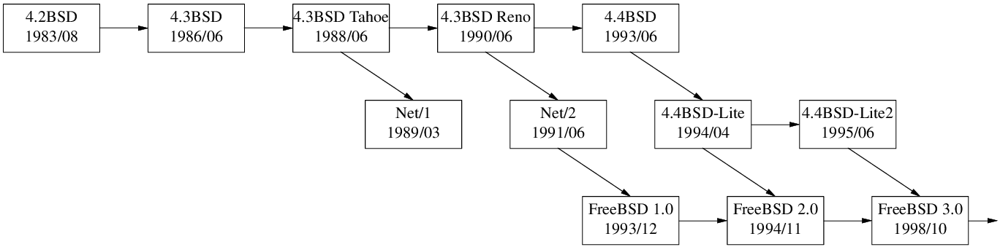

# Envolution of File Descriptor Table in Linux Kernel

## 0.01 to 1.1.10

A fixed length array in `struct task_struct`.

```c
// include/linux/sched.h of linux-1.1.10

struct task_struct {
        // ...
        struct file * filp[NR_OPEN];
        fd_set close_on_exec;
        // ...
}
```

## 1.1.11 to 1.3.21

Split into `struct files_struct`.
1.1.11 was released in 1995/05.

```c
// include/linux/sched.h of linux-1.3.21

struct files_struct {
        int count;
        fd_set close_on_exec;
        struct file * fd[NR_OPEN];
};

struct task_struct {
        // ...

/* open file information */
        struct files_struct files[1];

        // ...

}
```

## 1.3.22 to 2.1.89

Change `files` from a `struct[1]` to a pointer, so it can be shared by threads within a process.
1.3.22 was released in 1995/09.  LinuxThreads needs 2.0 kernel, which was released in 1996/07.

```diff
// include/linux/sched.h of linux-2.0.2

/* Open file table structure */
struct files_struct {
        int count;
        fd_set close_on_exec;
        fd_set open_fds;
        struct file * fd[NR_OPEN];
};

struct task_struct {
        // ...

/* open file information */
-       struct files_struct files[1];
+       struct files_struct *files;


        // ...

}
```

## 2.1.90 to 2.6.13

Change fixed-length array `fd` to dynamic array.
2.2.0 was released in 1999/01.

```diff
// include/linux/sched.h of linux-2.2.0

/*
 * Open file table structure
 */
struct files_struct {
        atomic_t count;
+       int max_fds;
+       struct file ** fd;      /* current fd array */
        fd_set close_on_exec;   // changed to fd_set* in 2.2.12
        fd_set open_fds;
-       struct file * fd[NR_OPEN];
};

struct task_struct {
        // ...

/* open file information */
        struct files_struct *files;

        // ...

}
```


## 2.6.14 to now (4.15.7)

Introduce `struct fdtable` for RCU. 2.6.15 was released in 2006/01, Ubuntu 6.04 LTS and Debian 4 ship it.

```c
// include/linux/fdtable.h of linux-2.6.37

struct fdtable {
        unsigned int max_fds;
        struct file __rcu **fd;      /* current fd array */
        fd_set *close_on_exec;
        fd_set *open_fds;
        struct rcu_head rcu;
        struct fdtable *next;
};

/*
 * Open file table structure
 */
struct files_struct {
  /*
   * read mostly part
   */
        atomic_t count;
        struct fdtable __rcu *fdt;
        struct fdtable fdtab;
  /*
   * written part on a separate cache line in SMP
   */
        spinlock_t file_lock ____cacheline_aligned_in_smp;
        int next_fd;
        struct embedded_fd_set close_on_exec_init;
        struct embedded_fd_set open_fds_init;
        struct file __rcu * fd_array[NR_OPEN_DEFAULT];
};

struct task_struct {
        // ...

/* open file information */
        struct files_struct *files;

        // ...

}
```

`struct file` itself.

```c
// include/linux/fs.h of linux-4.9

struct file {
        union {
                struct llist_node       fu_llist;
                struct rcu_head         fu_rcuhead;
        } f_u;
        struct path             f_path;
        struct inode            *f_inode;  /* cached value */ // added back in 3.9, same as f_path.dentry->d_inode
        const struct file_operations    *f_op;

        /*
         * Protects f_ep_links, f_flags.
         * Must not be taken from IRQ context.
         */
        spinlock_t              f_lock;
        atomic_long_t           f_count;
        unsigned int            f_flags;
        fmode_t                 f_mode;
        struct mutex            f_pos_lock;  // Fixed in 3.14
        loff_t                  f_pos;
        struct fown_struct      f_owner;
        const struct cred       *f_cred;
        struct file_ra_state    f_ra;

        u64                     f_version;
#ifdef CONFIG_SECURITY
        void                    *f_security;
#endif
        /* needed for tty driver, and maybe others */
        void                    *private_data;

#ifdef CONFIG_EPOLL
        /* Used by fs/eventpoll.c to link all the hooks to this file */
        struct list_head        f_ep_links;
        struct list_head        f_tfile_llink;
#endif /* #ifdef CONFIG_EPOLL */
        struct address_space    *f_mapping;
} __attribute__((aligned(4)));  /* lest something weird decides that 2 is OK */
```

# FreeBSD up to 9.3



4.3BSD-Reno and older BSDes use fixed-length array of `struct file*`.

```
struct user {
        // ...
        struct  file *u_ofile[NOFILE];  /* file structures for open files */
        // ...
};
```

From BSD Net/2 up to FreeBSD 9.3 use a similiar dynamic array data structure of Linux 2.0 (see diagram above.),
where `proc` == `task_struct`, `filedesc` == `files_struct`, `file` == `file`.

```c
// sys/proc.h
/*
 * Process structure.
 */
struct proc {
        // ...
        struct filedesc *p_fd;          /* (b) Open files. */
        // ...
};

// sys/filedesc.h
struct filedesc {
        struct  file **fd_ofiles;       /* file structures for open files */
        char    *fd_ofileflags;         /* per-process open file flags */
        struct  vnode *fd_cdir;         /* current directory */
        struct  vnode *fd_rdir;         /* root directory */
        struct  vnode *fd_jdir;         /* jail root directory */
        int     fd_nfiles;              /* number of open files allocated */
        NDSLOTTYPE *fd_map;             /* bitmap of free fds */
        int     fd_lastfile;            /* high-water mark of fd_ofiles */
        int     fd_freefile;            /* approx. next free file */
        u_short fd_cmask;               /* mask for file creation */
        u_short fd_refcnt;              /* thread reference count */
        u_short fd_holdcnt;             /* hold count on structure + mutex */
        struct  sx fd_sx;               /* protects members of this struct */
        struct  kqlist fd_kqlist;       /* list of kqueues on this filedesc */
        int     fd_holdleaderscount;    /* block fdfree() for shared close() */
        int     fd_holdleaderswakeup;   /* fdfree() needs wakeup */
};

// sys/file.h
struct file {
        void            *f_data;        /* file descriptor specific data */
        struct fileops  *f_ops;         /* File operations */
        struct ucred    *f_cred;        /* associated credentials. */
        struct vnode    *f_vnode;       /* NULL or applicable vnode */
        short           f_type;         /* descriptor type */
        short           f_vnread_flags; /* (f) Sleep lock for f_offset */
        volatile u_int  f_flag;         /* see fcntl.h */
        volatile u_int  f_count;        /* reference count */
        // ...
        off_t           f_offset;
        // ...
}
```
