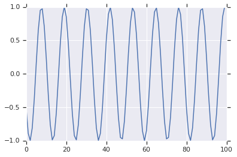
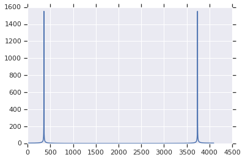

# Links

* [42 Years of Microprocessor Trend Data](https://www.karlrupp.net/2018/02/42-years-of-microprocessor-trend-data/) by Karl Rupp


## Maths

* [Theory and Applications of Markov Chains to Finance](http://www.atteson.com/Markov/) by Kevin Atteson
* [Reed-Solomon](http://web.eecs.utk.edu/~plank/plank/papers/CS-05-569.html) by James S. Plank,
also [tutorials](http://web.eecs.utk.edu/~plank/plank/www/software.html) and
[SPE97](http://cgi.di.uoa.gr/~ad/M155/Papers/RS-Tutorial.pdf)

## DFT/FFT

$$ X_k = \sum_{n=0}^{N-1} x_n e^{-j 2 \pi k n / N} $$

<video controls="controls">
  <source type="video/mp4" src="../media/dft-basis.mp4"></source>
  <p>Your browser does not support the video element.</p>
</video>

* [Wikipedia](https://en.wikipedia.org/wiki/Discrete_Fourier_transform)
* [Wikibooks](https://en.wikibooks.org/wiki/Digital_Signal_Processing/Discrete_Fourier_Transform)
* [DFT matrix](https://en.wikipedia.org/wiki/DFT_matrix)
* [Smith's Guide to DSP, ch.8](http://www.dspguide.com/ch8/1.htm) by Steven W. Smith
* [Mathematics of the Discrete Fourier Transform](http://ccrma.stanford.edu/~jos/mdft/) by Julius O. Smith
* [The Discrete Fourier Transform](http://dsp-book.narod.ru/TDCH/CH-02.PDF) by Ivan W. Selenick and Gerald Schuller.  From chapter 2 of _The Transform and Data Compression Handbook_ ed. by [Kamisetty Ramam Rao](https://en.wikipedia.org/wiki/K._R._Rao) and Patrick C. Yip
* [The Discrete Fourier Transform](https://web.eecs.umich.edu/~fessler/course/451/l/pdf/c5.pdf) by prof. [Jeffrey A. Fessler](http://web.eecs.umich.edu/~fessler/) from [EECS 451, Digital Signal Processing and Analysis](https://web.eecs.umich.edu/~fessler/course/451/)
* [The Discrete Fourier Transform](http://www.robots.ox.ac.uk/~sjrob/Teaching/SP/l7.pdf) by prof. [Stephen Roberts](http://www.robots.ox.ac.uk/~sjrob/) from [Signal Processing & Filter Design](http://www.robots.ox.ac.uk/~sjrob/Teaching/sp_course.html)

## Digital Sinusoid Generators

* [DTMF Tone Generation and Detection](http://www.ti.com/lit/an/spra096a/spra096a.pdf) by Gunter Schmer

Second-order digital resonator in Python:
```python
fs = 8000  # sampling frequency
fo = 700   # output frequency
A = 1.0    # amplitude
w = 2*pi*fo/fs    # angular frequency of fo
c = 2.0 * cos(w)  # coefficient, controls the frequency, 1.70528
x = -A * sin(w)   # initial value, controls the amplitude and phase, -0.522498
y = 0.0
for ever:
    emit(x)
    x, y = c*x - y, x
```
First 100 data points:



```python
N = 4096
f = fft(signal[:N])
p = np.argmax(abs(f)[:N//2])
print(p*fs/N) => 699.21895 Hz
```

FFT:


* [Digital Waveguide Oscillator](https://ccrma.stanford.edu/~jos/pasp/Digital_Waveguide_Oscillator.html) by Julius O. Smith
* [Effect Design Part 3 Oscillators: Sinusoidal and Pseudonoise](https://ccrma.stanford.edu/~dattorro/EffectDesignPart3.pdf) by Jon Dattorro
* [A sine generation algorithm for VLSI applications](https://ccrma.stanford.edu/~jos/pdf/GordonAndSmith86.pdf) by John W. Gordon and Julius O. Smith
* [The Second-Order Digital Waveguide Oscillator](https://ccrma.stanford.edu/~jos/wgo/wgo.pdf) by Julius O. Smith and Perry R. Cook
* [AN-263 Sine Wave Generation Techniques](http://www.ti.com/lit/an/snoa665c/snoa665c.pdf)
* [5 ways to generate a sine wave](https://www.analogictips.com/sine-wave-generation/)


