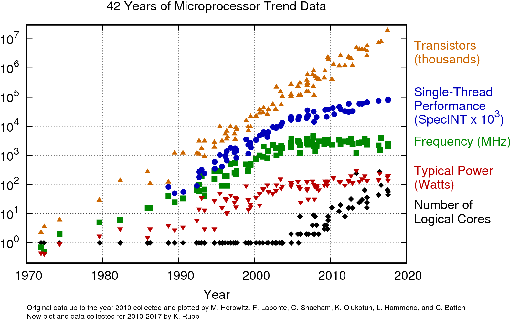
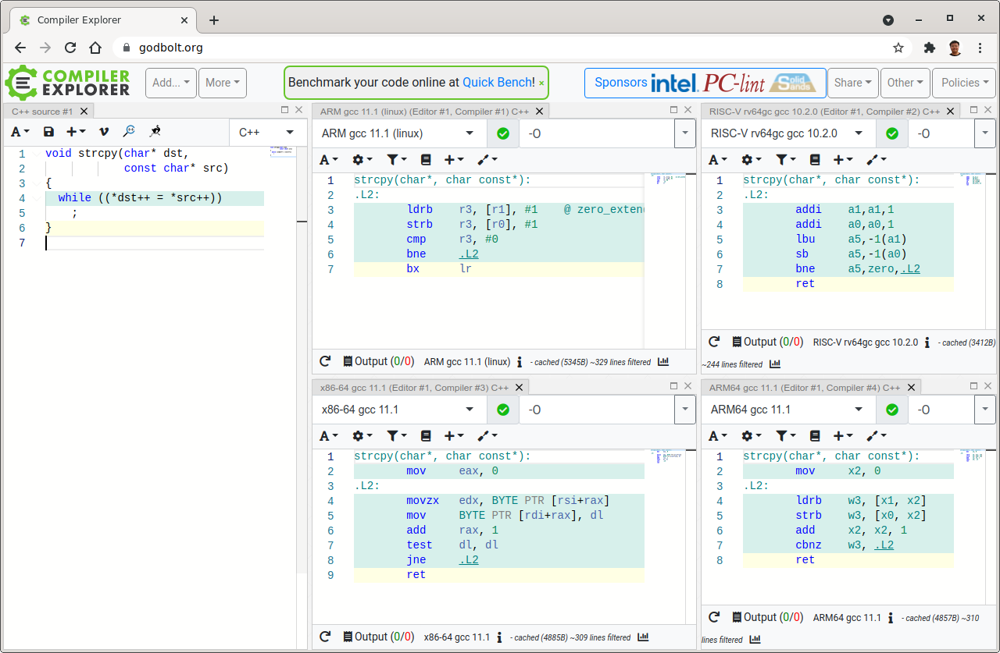
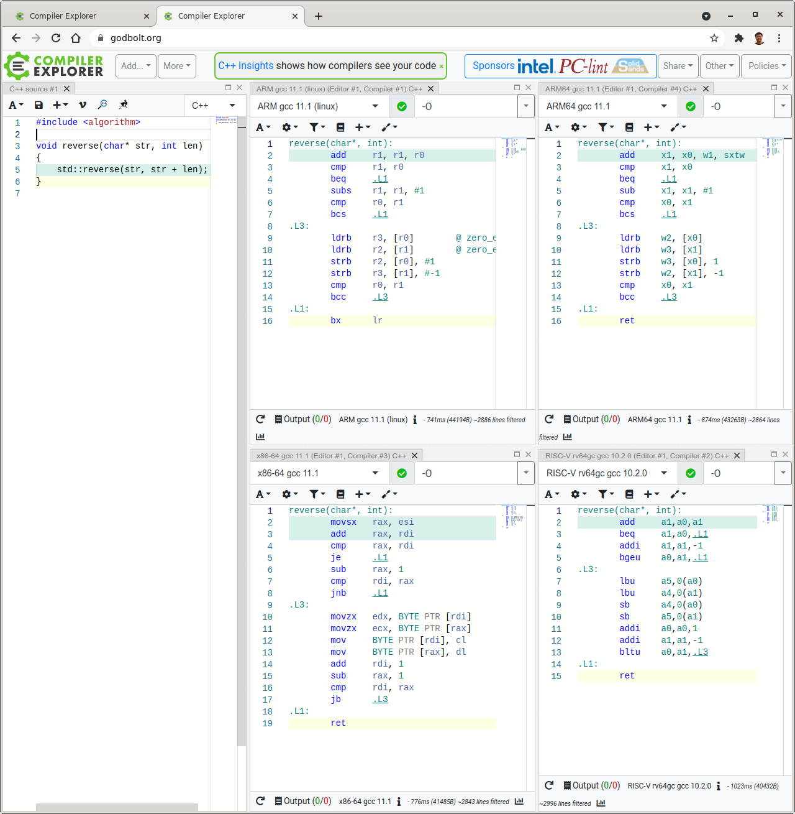

# Links

* [42 Years of Microprocessor Trend Data](https://www.karlrupp.net/2018/02/42-years-of-microprocessor-trend-data/) by Karl Rupp

* [The Architecture of Open Source Applications](http://aosabook.org)
    1. Volumn I and II
    1. The Performance of Open Source Applications
    1. 500 Lines or Less
* [Producing Wrong Data Without Doing Anything Obviously Wrong!](https://users.cs.northwestern.edu/~robby/courses/322-2013-spring/mytkowicz-wrong-data.pdf)
    *  Changing a seemingly innocuous aspect of an experimental setup can cause a systems researcher to draw wrong conclusions from an experiment. What appears to be an innocuous aspect in the experimental setup may in fact introduce a significant bias in an evaluation. (i) UNIX environment size, (ii) link order.
* [Matthew Austern's list of publications](http://lafstern.org/matt/publications.html)
    * [Why you shouldn't use set (and what you should use instead)](http://lafstern.org/matt/col1.pdf)

## System programming

* [Excuse me son, but your code is leaking !!!](https://danwalsh.livejournal.com/53603.html) on Dan Walsh's Blog, about `FD_CLOEXEC` and `O_CLOEXEC`
* [Secure File Descriptor Handling](https://udrepper.livejournal.com/20407.html) by Ulrich Drepper, about `O_CLOEXEC`, `O_NONBLOCK`.
* [A fork() in the road](https://www.microsoft.com/en-us/research/uploads/prod/2019/04/fork-hotos19.pdf) from HotOS '19.
* [LLNL Tutorials](https://hpc-tutorials.llnl.gov/)
    * [Introduction To Parallel Computing](https://hpc.llnl.gov/documentation/tutorials/introduction-parallel-computing-tutorial)
    * [POSIX Threads Programming](https://hpc-tutorials.llnl.gov/posix/)

## Compiler

* [Old school strcpy(3)](https://godbolt.org/z/jr99qncW5) on modern compiler. 
* [std::reverse() a string](https://godbolt.org/z/9crsYrWo1) on modern compiler. 
* [Run 32-bit ARM binary on ARM64](https://askubuntu.com/questions/1090351/can-i-run-an-arm32-bit-app-on-an-arm64bit-platform-which-is-running-ubuntu-16-04)

## Time-keeping

* [The Science of Timekeeping](http://www.allanstime.com/Publications/DWA/Science_Timekeeping/TheScienceOfTimekeeping.pdf) HP Application Note 1289.
* [HP 5071A Primary Frequency Standard](https://ilrs.gsfc.nasa.gov/docs/timing/HP5071A.pdf)
* [GPS and Precision Timing Applications](http://leapsecond.com/hpan/an1272.pdf) HP Application Note 1272.
* [Project GREAT: General Relativity Einstein/Essen Anniversary Test](http://www.leapsecond.com/great2005/)
* [Leap Smear](https://developers.google.com/time/smear) for applying leap seconds smoothly.
* Day of the weekday: [Zeller's congruence](https://en.wikipedia.org/wiki/Zeller%27s_congruence),
  [RFC3339](https://tools.ietf.org/html/rfc3339#appendix-B)

## LZ77 and zlib
* <http://zlib.net>
    * <http://www.zlib.net/feldspar.html>
    * M$'s IIS <http://www.zlib.net/zlib_faq.html#faq39>
* [RFC1951](https://tools.ietf.org/html/rfc1951)
* Mark Adler's post: <https://stackoverflow.com/questions/20762094/how-are-zlib-gzip-and-zip-related-what-do-they-have-in-common-and-how-are-they>
* <https://en.wikipedia.org/wiki/Canonical_Huffman_code>
* <https://jvns.ca/blog/2013/10/24/day-16-gzip-plus-poetry-equals-awesome/>
* [Dissecting the GZIP format](http://www.infinitepartitions.com/art001.html)

## Unix history

* [Evolution of the Unix System Architecture: An Exploratory Case Study](https://dx.doi.org/10.1109/TSE.2019.2892149), [Video from FOSDEM'18](https://youtu.be/FbDebSinSQo) by [Diomidis Spinellis](https://www2.dmst.aueb.gr/dds/).
* [A repository of Unix History and evolution](https://www2.dmst.aueb.gr/dds/pubs/jrnl/2016-EMPSE-unix-history/html/unix-history.html)

## Maths

* [Theory and Applications of Markov Chains to Finance](http://www.atteson.com/Markov/) by Kevin Atteson
