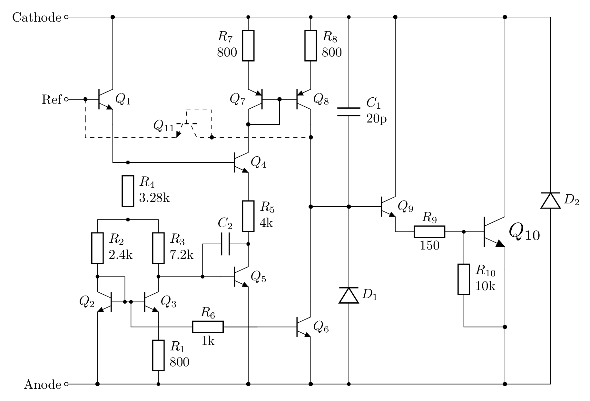
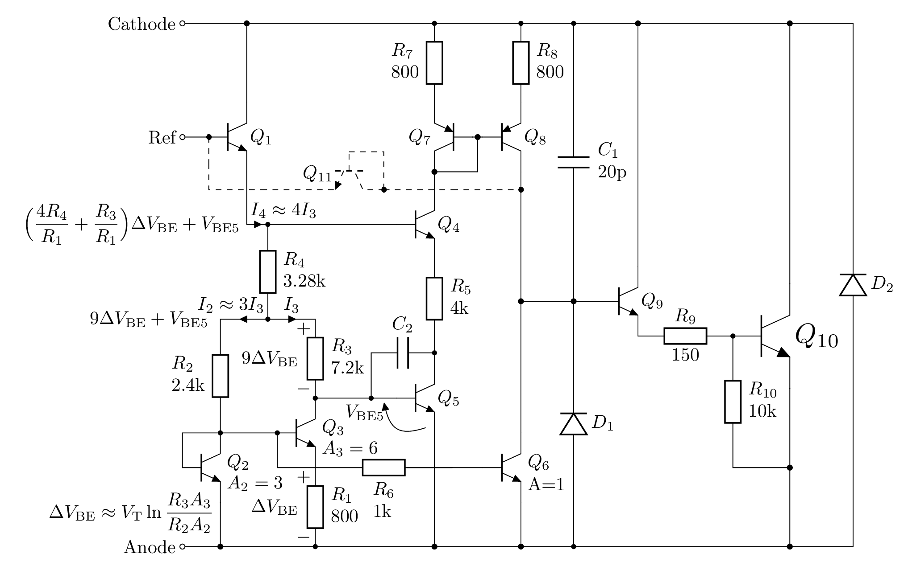
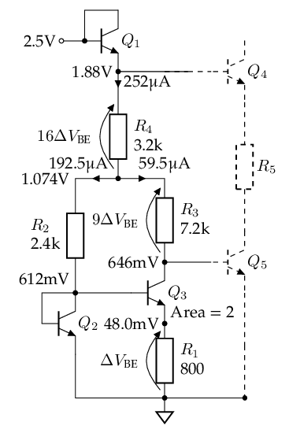
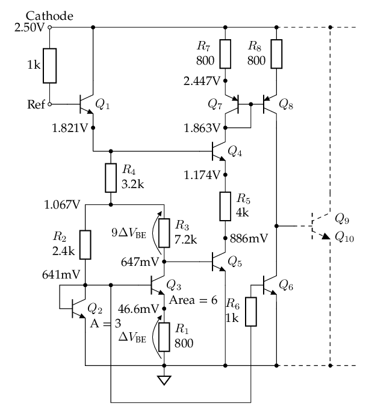
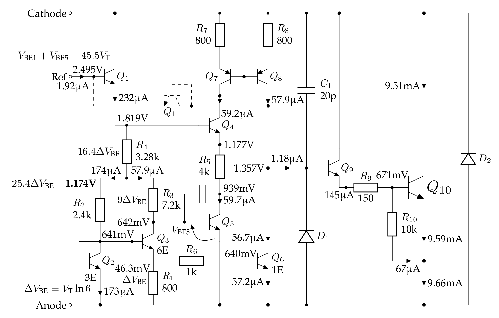
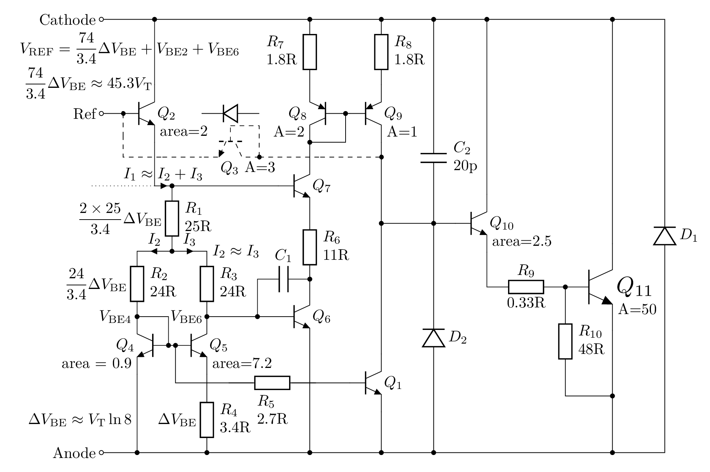
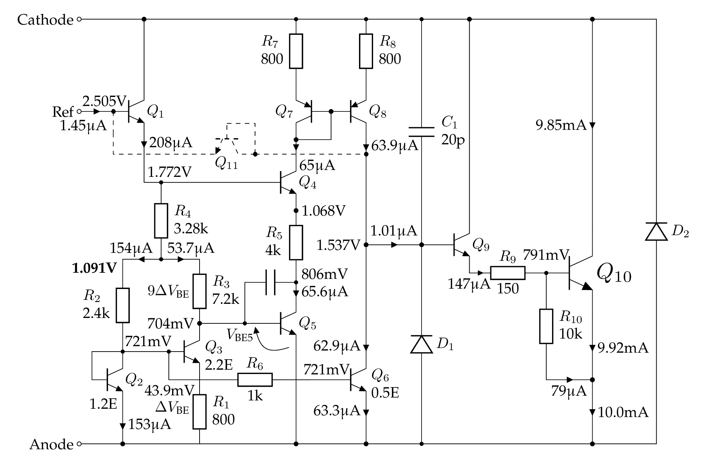

# TL431

Comments and discussions: <https://github.com/chenshuo/notes/discussions>

## Bandgap voltage reference

See "How a bandgap reference works" section in <https://www.righto.com/2014/09/reverse-engineering-counterfeit-7805.html>

The thermal voltage \(V_\mathrm{T} = \dfrac{kT}{q}\) is proportional to absolute temperature (PTAT). \(V_\mathrm{T} \approx 25.8\mathrm{mV}\) at room temperature (27°C, or 300K).

> Ref. <https://en.wikipedia.org/wiki/Boltzmann_constant#The_thermal_voltage>

\(V_\mathrm{T}\) has a positive temperature coefficient of about 86.2μV/°C.

> \(\dfrac{V_\mathrm{T}}{T} = \dfrac{k}{q} = \dfrac{ 1.380649\times 10^{-23}}{1.602176634\times 10^{-19}} \approx 8.62 \times 10^{-5}\mathrm{V/K}\)

Therefore, we usually need \(10\ln 10 \cdot V_\mathrm{T}\approx 23V_\mathrm{T}\) to cancel out the tempco of one \(V_\mathrm{BE}\), which normally has a negative tempco about -2mV/°C.

> \(10 \ln 10 \times 86.2 \approx 23 \times 86.2 = 1.983\mathrm{mV/°C}\)

The actual tempco of \(V_\mathrm{BE}\) is related to \(V_\mathrm{BE}\) itself, see formula in <https://en.wikipedia.org/wiki/Silicon_bandgap_temperature_sensor>

## The internal schematic

Resistors are taken from official TI datasheet <https://www.ti.com/lit/ds/symlink/tl431.pdf>.

The resistor and transistor numbering follows [SPICE model by Eugene Dvoskin](https://www.audio-perfection.com/voltage-regulators/linear-regulators/accurate-tl431-model-development-analysis-and-evaluation/).

Transistor \(Q_{11}\) is drawn in dashed lines, as it is off in normal operation mode.
IIUC, it acts like a diode to shutdown the output when `Ref` is connected to `Anode`.

## Analysis

Ignoring base currents, assuming \(\beta\gg 1\).
As we will see in the next section , we can actually estimate that \(\beta\approx 120\).

For the following analysis, we assume area ratio of \(Q_6:Q_2:Q_3\) being \(1:3:6\), taken from [The TL431 in loop control](https://powersimtof.com/Downloads/Papers/The%20TL431%20in%20loop%20control.pdf) by Christophe Basso.
Eugene Dvoskin's SPICE model (at the end of this page) uses a different ratio (\(0.5:1.2:2.2\)) though.

1. There are 11 transistors in total, \(Q_{11}\) is normally off, so we need to analyze 10 BJTs only.
1. It's easy to see that \(Q_9\) and \(Q_{10}\) form a Darlinton pair, it's the output stage.
1. It's also easy to recognize that \(Q_7\) and \(Q_8\) is a [current mirror](https://en.wikipedia.org/wiki/Current_mirror), if we assuming they have the same area. (In Ken Shirriff's schematic below, their areas are different, though.)
1. The rest of 6 transistors \(Q_{1\dots 6}\) are tangled together, let's analyse them in parts.

## Calculation

1.

The voltages and currents are from SPICE simulation.

## Simulation

TODO: set up

## Another schematic by Ken Shirriff

<https://www.righto.com/2014/05/reverse-engineering-tl431-most-common.html>

Note: the transistor and resistor numbers in the following schematic match Ken Shirriff's post, don't be confused.

> The resistances on the official schematic above are very different from what can be seen from the die.

Here's brief analysis of its DC operating point, ignoring base currents.

1. Assuming \(V_\mathrm{BE4}\approx V_\mathrm{BE6}\approx 0.65\mathrm{V}\)
1. Voltage drops on \(R_2\) and \(R_3\) are approx the same. \(R_2 = R_3\) and \(V_\mathrm{R2}\approx V_\mathrm{R3}\), so \(I_2\approx I_3\).
1. The area ratio of \(Q_4\) and \(Q_5\) is \(0.9:7.2\), so voltage on \(R_4\) is \(\Delta V_\mathrm{BE} = V_\mathrm{T}\ln \dfrac{7.2}{0.9}= V_\mathrm{T}\ln 8\approx 53.6\mathrm{mV}\) at room temperature.

1. Assuming for \(Q_5\), its \(I_\mathrm{C5} = I_\mathrm{E5} = I_3\), so voltage on \(R_3\) is \(\dfrac{24}{3.4}\Delta V_\mathrm{BE}\)

1. Voltage on \(R_1\) is \(I_1 R_1 = 2 I_3 R_1 = 2 \dfrac{R_1}{R_4}\Delta V_\mathrm{BE} =\dfrac{2\times 25}{3.4} \Delta V_\mathrm{BE}\).

1. In total, \(V_\mathrm{REF} = V_\mathrm{BE6} + V_\mathrm{R3} + V_\mathrm{R1} + V_\mathrm{BE2} = \dfrac{2\times 25 + 24}{3.4} \Delta V_\mathrm{BE} + V_\mathrm{BE6}  + V_\mathrm{BE2} = \dfrac{74}{3.4} \Delta V_\mathrm{BE} + 2V_\mathrm{BE} \)

1. The PTAT portion \(\dfrac{74}{3.4} \Delta V_\mathrm{BE} = 21.765\times\ln 8 V_\mathrm{T} \approx 45.26  V_\mathrm{T}\), which should be in right amount to cancel tempco of two \(V_\mathrm{BE}\).

## SPICE model by Eugene Dvoskin

<https://www.audio-perfection.com/voltage-regulators/linear-regulators/accurate-tl431-model-development-analysis-and-evaluation/>

TODO: set up

The Vref can be tuned to 2.495V by changing R4 to 3.22kΩ.
