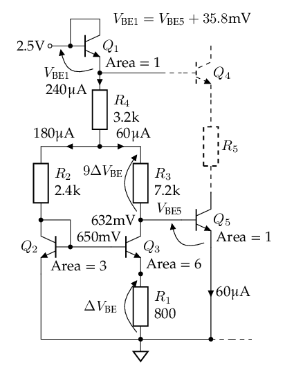
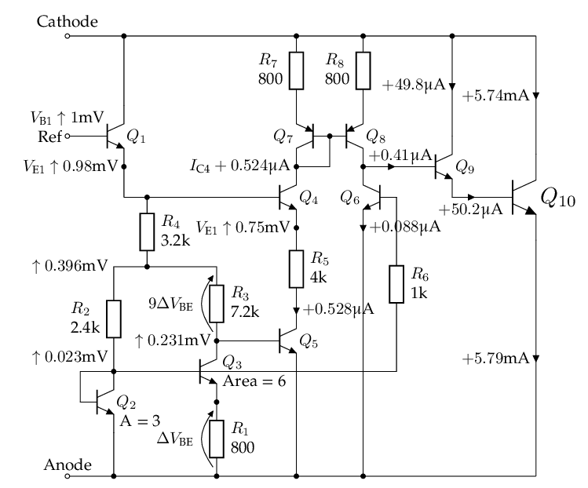
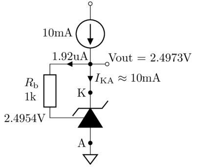
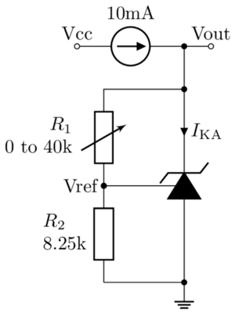
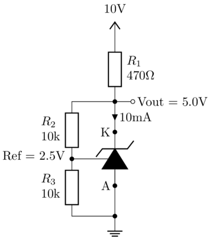

# TL431 Analysis and Simulation

By Shuo Chen (chenshuo_at_chenshuo.com)

Latest version: <https://chenshuo.github.io/notes/tl431/>

Comments and discussions: <https://github.com/chenshuo/notes/discussions>

Series of analysis & simulation of IC regulator designed in 1970s:

1. [μA78L05](https://chenshuo.github.io/notes/UA78L05)
2. [LM7805](https://chenshuo.github.io/notes/LM7805)
3. [TL431](https://chenshuo.github.io/notes/TL431) <- This page

In this post, transistor = BJT, however, base currents are ignored by default.

## Bandgap voltage reference

See "How a bandgap reference works" section in <https://www.righto.com/2014/09/reverse-engineering-counterfeit-7805.html>

The thermal voltage \(V_\mathrm{T} = \dfrac{kT}{q}\) is proportional to absolute temperature (PTAT). \(V_\mathrm{T} \approx 25.8\mathrm{mV}\) at room temperature (27°C, or 300K).

> Ref. <https://en.wikipedia.org/wiki/Boltzmann_constant#The_thermal_voltage>

\(V_\mathrm{T}\) has a positive temperature coefficient of about 86.2μV/°C.

> \(\dfrac{V_\mathrm{T}}{T} = \dfrac{k}{q} = \dfrac{ 1.380649\times 10^{-23}}{1.602176634\times 10^{-19}} \approx 8.62 \times 10^{-5}\mathrm{V/K}\)

Therefore, we usually need \(10\ln 10 \cdot V_\mathrm{T}\approx 23V_\mathrm{T}\) to cancel out the tempco of one \(V_\mathrm{BE}\), which normally has a negative tempco about -2mV/°C.

> \(10 \ln 10 \times 86.2 \approx 23 \times 86.2 = 1.983\mathrm{mV/°C}\)

The actual tempco of \(V_\mathrm{BE}\) is related to \(V_\mathrm{BE}\) itself, its first order approximation is \(\dfrac{V_\mathrm{BE0} - V_\mathrm{g0}}{T_0}\), see formula in <https://en.wikipedia.org/wiki/Silicon_bandgap_temperature_sensor>

[Ebers–Moll model](https://en.wikipedia.org/wiki/Bipolar_junction_transistor#Ebers%E2%80%93Moll_model):
\(I_\mathrm{E} \approx I_\mathrm{S}\exp \dfrac{V_\mathrm{BE}}{V_\mathrm{T}}\), equivalently
\(V_\mathrm{BE} = V_\mathrm{T}\ln \dfrac{I_\mathrm{E}}{I_\mathrm{S}}\).

[Reverse saturation current](https://en.wikipedia.org/wiki/Saturation_current) \(I_\mathrm{S}\) is directly proportional to the emitter-base junction area of a transistor, which we just call the *area* of the transistor.

If we set different emitter currents of two transistors,
we will get two different \(V_\mathrm{BE}\),
their difference is called \(\Delta V_\mathrm{BE}\),
\(\Delta V_\mathrm{BE} = V_\mathrm{T}\ln\dfrac{J_1}{J_2}\).
\(J\) is current density, directly proportional to emitter current \(I_\mathrm{E}\),
 inversely proportional to its area.

## The internal schematic

Resistor values are taken from official TI datasheet <https://www.ti.com/lit/ds/symlink/tl431.pdf>.

The resistor and transistor numbering follows [SPICE model by Eugene Dvoskin](https://www.audio-perfection.com/voltage-regulators/linear-regulators/accurate-tl431-model-development-analysis-and-evaluation/).

Transistor \(Q_{11}\) is drawn in dashed lines, as it is off in normal operation mode.
IIUC, it acts like a diode to shutdown the output when `Ref` is connected to `Anode`.

## Analysis

Ignoring base currents, assuming \(\beta\gg 1\).
As we will see in the next section , we can actually estimate that \(\beta\approx 120\).

For the following analysis, we assume area ratio of \(Q_6:Q_2:Q_3\) being \(1:3:6\), taken from [The TL431 in loop control](https://powersimtof.com/Downloads/Papers/The%20TL431%20in%20loop%20control.pdf) by Christophe Basso.
Eugene Dvoskin's SPICE model (at the end of this page) uses a different ratio (\(0.5:1.2:2.2\)) though.

> To show a larger image, right click and then "Open image in new tab".

1. There are 11 transistors in total, \(Q_{11}\) is normally off, so we need to analyze 10 BJTs only.
1. It's easy to see that \(Q_9\) and \(Q_{10}\) form a Darlinton pair, it's the output stage.
1. It's also easy to recognize that \(Q_7\) and \(Q_8\) is a [current mirror](https://en.wikipedia.org/wiki/Current_mirror), if we assuming they have the same area. (In Ken Shirriff's schematic below, their areas are different, though.)
1. The rest of 6 transistors \(Q_1\dots Q_6\) are tangled together, let's analyze them in parts.

**Notation**:

* \(V_\mathrm{BE1}\) denotes the Base-Emitter junction voltage of transistor \(Q_1\)
* \(V_\mathrm{Q2B}\) denotes the base voltage of transistor \(Q_2\).
* \(V_\mathrm{Q3E}\) denotes the emitter voltage of transistor \(Q_3\), which is also known as \(\Delta V_\mathrm{BE}\).
* It's obvious from the schematic above, \(V_\mathrm{Q3C} = V_\mathrm{Q5B}\).
* \(I_\mathrm{B6}\) denotes the base current of transistor \(Q_6\), which equals to currents on \(R_6\), \(I_\mathrm{R6}\).
* \(V_\mathrm{R3}\) denotes the voltage across resistor \(R_3\), which is \(9 \Delta V_\mathrm{BE}\), assuming \(I_\mathrm{C3}\approx I_\mathrm{E3}\).
* \(I_2\), \(I_3\), \(I_1\) are currents on \(R_2\), \(R_3\), \(R_4\), respectively, \(I_1 = I_2 + I_3\) as shown in the full schematic above.
* Ignoring base currents, \(I_2 = I_\mathrm{C2} =  I_\mathrm{E2}\), \(I_3 = I_\mathrm{C3} =  I_\mathrm{E3}\), \(I_1 = I_\mathrm{C1} =  I_\mathrm{E1}\).

## Calculation

### Reference voltage

The reference voltage can be divided into 4 segments, from base of \(Q_1\) to ground: \(V_\mathrm{REF} = V_\mathrm{BE1} + V_\mathrm{R4} + V_\mathrm{R3} + V_\mathrm{BE5}\).

**First**, we consider \(Q_2, Q_3\) and resistors connected to them, it's easy to find \(I_2 = 3I_3\).

1. Assuming \(V_\mathrm{BE2}=V_\mathrm{BE5}\approx 0.65\mathrm{V}\),
\(V_\mathrm{R2}=V_\mathrm{R3}\).

2. \(I_2 R_2 = I_3 R_3\), so \(I_2 = \dfrac{R_3}{R_2}I_3 = 3I_3\).
3. \(\Delta V_\mathrm{BE} = V_\mathrm{BE2} -V_\mathrm{BE3} = V_\mathrm{T}\ln 6\approx 46.3\)mV, given that the area of \(Q_3\) is \(2\times\) of \(Q_2\).
4. \(V_\mathrm{R3} = \dfrac{R_3}{R_1}\Delta V_\mathrm{BE} = 9\Delta V_\mathrm{BE}\), assuming \(I_\mathrm{C3}\approx I_\mathrm{E3}\).
5. The current on \(R_4\) is \(I_1 = I_2 + I_3 = 4I_3\), so \(V_\mathrm{R4} = \dfrac{4 R_4}{R_1}\Delta V_\mathrm{BE} = 16.4\Delta V_\mathrm{BE}\)
6. Sum of voltages across \(R_3\) and \(R_4\) is \(V_\mathrm{R3} + V_\mathrm{R4} = (9+16.4) \Delta V_\mathrm{BE} = 25.4\Delta V_\mathrm{BE}=25.4\ln 6 V_\mathrm{T}\approx 45.5 V_\mathrm{T}\approx 1.174\)V.
7. Tempco of \(V_\mathrm{R3} + V_\mathrm{R4}\) is \(45.5 \times 86.2\) = 3.922 mV/°C, canceling out negative tempco of \(V_\mathrm{BE1} + V_\mathrm{BE5}\), which is \(\dfrac{V_\mathrm{BE1} - V_\mathrm{g0}}{T_0} +\dfrac{V_\mathrm{BE5} - V_\mathrm{g0}}{T_0}\)
8. In theory, \(V_\mathrm{REF} = 2V_\mathrm{g0}\) when its tempco is zero.

\(R_4\) is critical, it controls both \(V_\mathrm{REF}\) and its tempco, I guess that's why it shows 3 decimal places in the datasheet (3.28kΩ), while other resistors has only 2.

Estimating \(\beta\) for fun. It's rough estimation, so we use rounded values, like 1.2V, instead of 1.174V for  \(V_\mathrm{R3} + V_\mathrm{R4}\).

1. Assuming \(V_\mathrm{BE1}=V_\mathrm{BE5}=0.65\)V for now.
2. Sum of voltages across \(R_3\) and \(R_4\) is \(V_\mathrm{REF} - V_\mathrm{BE1}-V_\mathrm{BE5} = 2.5-2\times 0.65 = 1.2\mathrm{V}\)
3. The total resistance across the aforementioned 1.2V is \(R_4 + R_2/\!/R_3 = 3.2 + 2.4 /\!/ 7.2 = 3.2+1.8 = 5\)kΩ
4. The current on \(R_4\) is \(I_1 =  \dfrac{1.2}{5} = 0.24\)mA, so
\(I_\mathrm{E1} = 240\)μA,
5. The current on \(R_4\) is \(I_1 = I_2 + I_3 = 4I_3\), so \(I_3 = I_1/4 = 60\)μA, and \(I_2 = 3I_3 = 180\)μA.
6. The datasheet says typical \(I_\mathrm{REF}=I_\mathrm{B1}=2\)μA, so we estimate \(\beta + 1 = I_{E1}/I_\mathrm{B1} = 240/2 = 120\).

The voltages and currents shown in above schematic are from SPICE simulation.

### Error amplifier

**Second**, we add \(Q_4\dots Q_8\) into the picture, omitting \(Q_9\) and \(Q_{10}\) for now.

It's safe to assume that all \(Q_4\dots Q_8\) share the same (emitter) current, because \(Q_7\) and \(Q_8\) form a current mirror, and it sets the currents of \(Q_4\), \(Q_5\), and \(Q_6\) to be all the same.

We will show that the current is 60μA for \(Q_4\dots Q_8\), same as emitter current of \(Q_3\).

1. \(V_\mathrm{Q2B} \approx V_\mathrm{Q6B}\), because \(I_\mathrm{B6}\) is less than 1μA, so voltage drop on \(R_6\) is less than 1mV.
2. Area of \(Q_6\) is 1E, area of \(Q_2\) is 3E, with the same base voltage, \(I_\mathrm{E2} = 3 I_\mathrm{E6}\)
3. We already knew that \(I_\mathrm{E2} = I_2 = 3I_3\), so \(I_3 = I_\mathrm{E6} = I_\mathrm{E3} = 60\)μA. In other words, \(Q_6\) has same current as \(Q_3\).
4. Due to current mirror made of \(Q_7\) and \(Q_8\), \(Q_4\) and \(Q_5\) mirrors the current of \(Q_6\). (But, see the note below.)
5. In conclusion, 6 transistors \(Q_3\dots Q_8\) all have the same current as \(Q_3\), when balanced, that is \(I_3=60\)μA.

Although this conclusion matches the simulation of the next section, there is an **unsolved puzzle**: the current mirror of \(Q_7\) and \(Q_8\) is supposed to copy \(Q_7\)'s current to \(Q_8\), but not vice versa.  However, the analysis above assume current of \(Q_6\), \(I_\mathrm{E6}\), is set by \(V_\mathrm{Q2B}\), then mirrored in \(Q_4\) and \(Q_5\).
Is this reasonable? My explanation is that the feedback of output stage will bring the circuit into the balanced state, where \(I_\mathrm{E4} = I_\mathrm{E6}\). (\(I_\mathrm{C6} = I_\mathrm{C8} - I_\mathrm{B9}\))

The following diagram shows what we have analyzed so far.

The voltages and currents shown in above schematic are from SPICE simulation.

### Tempco

Recall that \(V_\mathrm{REF} = V_\mathrm{BE1} + V_\mathrm{R4} + V_\mathrm{R3} + V_\mathrm{BE5} = 2.495\mathrm{V}\).

1. \(V_\mathrm{R3} + V_\mathrm{R4} = (9+16.4) \Delta V_\mathrm{BE} = 25.4\Delta V_\mathrm{BE}=25.4\ln 6 V_\mathrm{T}\approx 45.5 V_\mathrm{T}\approx 1.174\mathrm{V}\)

1. \( V_\mathrm{BE1}  +  V_\mathrm{BE5}  = V_\mathrm{REF} - (V_\mathrm{R3} + V_\mathrm{R4}) = 2.495 - 1.174 = 1.321\mathrm{V}\)

1. Tempco of \(V_\mathrm{R3} + V_\mathrm{R4}\) is \(45.5 \times 86.2\) = 3.922 mV/°C

1. Tempco of \(V_\mathrm{BE1} + V_\mathrm{BE5}\) is \(\dfrac{V_\mathrm{BE1} - V_\mathrm{g0}}{T_0} +\dfrac{V_\mathrm{BE5} - V_\mathrm{g0}}{T_0} = \dfrac{V_\mathrm{BE1} + V_\mathrm{BE5} - 2V_\mathrm{g0}}{T_0} = \dfrac{1.321 - 2\times 1.205}{300}=-3.63\) mV/°C

1. Tempco of  \(V_\mathrm{REF} = 3.922 - 3.63 = +0.292\)mV/°C

From this calculation, we concluded that TL431's reference voltage will change 20.44mV when temperature changes from 0°C to 70°C. However TL431 datasheet says it will only change 4mV in this case, which is 5x better than our calculation.

I don't know how does TL431 archive such good tempco when \(V_\mathrm{REF} = 2.495\mathrm{V}\),
because tempco of \(V_\mathrm{REF}\) is determined only by itself: \(\dfrac{\mathrm{d} V_\mathrm{REF}}{\mathrm{d}\, T}=\dfrac{V_\mathrm{REF} -  2V_\mathrm{g0}}{T_0} = 0.085/300=0.283\)mV/°C.
Unless the chip manufacturer managed to change \(V_\mathrm{g0}\).

**Third**, let's calculate the required \(I_\mathrm{S}\), just for fun.

Recall that \(V_\mathrm{REF} = V_\mathrm{BE1} + V_\mathrm{R4} + V_\mathrm{R3} + V_\mathrm{BE5} = 2.50\)V, in order to get \(V_\mathrm{R4} + V_\mathrm{R3} = 1.2\)V, we need \(V_\mathrm{BE1} + V_\mathrm{BE5} = 1.3\)V.

There are at least two ways to achieve that, given that \(I_\mathrm{E1} \approx 4 I_\mathrm{E5}\):

1. Area of \(Q_1\) is \(4\times\) of \(Q_5\), so \(V_\mathrm{BE1} = V_\mathrm{BE5} = 0.65\)V.
    * \(I_\mathrm{E5}=I_\mathrm{S}\exp\dfrac{V_\mathrm{BE5}}{V_\mathrm{T}}=60\)μA
    * \(I_\mathrm{S}\exp\dfrac{650}{25.8} = 60\times 10^{-6}\)
    * \(I_\mathrm{S} = 0.6865\)fA, this is for \(Q_5\)
    * for \(Q_1\), its \(I_\mathrm{S1} = 4 I_\mathrm{S} = 2.746\)fA.
2. Area of \(Q_1\) is the same as \(Q_5\),
so \(V_\mathrm{BE1} = V_\mathrm{BE5} + V_\mathrm{T}\ln 4\approx V_\mathrm{BE5}+35.8\)mV.
    * \(V_\mathrm{BE5} = (1300 - 35.8)/2 = 632\)mV, \(V_\mathrm{BE1} = 668\)mV
    * \(I_\mathrm{S}\exp\dfrac{632}{25.8} = 60\times 10^{-6}\)
    * \(I_\mathrm{S} = 1.379\)fA
    * for \(Q_1\), its \(I_\mathrm{S1} = I_\mathrm{S} = 1.379\)fA.

 second way to estimate \(I_\mathrm{S}\).

In the SPICE model, we set \(I_\mathrm{S} = 1.0\)fA for NPN transistors.

### Feedback

**Fourth**, the feedback loop.

\(Q_1\) is an emitter follower, \(Q_4\) and \(Q_6\) is differential pair, current mirror \(Q_7\) and \(Q_8\) serves as active load, the error amplifier output is collector of \(Q_8\), which feeds into base of \(Q_9\).

If \(V_\mathrm{REF}\) increases a tiny bit, we want to increase collector current of \(Q_{10}\) by a lot (a few mA per mV), to hopefully bring back \(V_\mathrm{REF}\) to its nominal value (2.495V) through the external feedback network (usually two resistors).

The following diagram shows what will happen if \(V_\mathrm{REF}\) increases by 1mV.

Explanation:

1. \(V_\mathrm{REF}\uparrow\Rightarrow V_\mathrm{Q1B} \uparrow \Rightarrow V_\mathrm{Q1E} \uparrow \Rightarrow V_\mathrm{Q4B} \uparrow\)
1. \(I_\mathrm{C4} \propto \exp V_\mathrm{BE4}\)
1. As \(V_\mathrm{Q4B} \uparrow\), \(I_\mathrm{C4}\uparrow\), it drains more current from \(Q_7\). Because \(Q_8\) mirrors \(Q_7\), so \(I_\mathrm{C8}\uparrow\).
1. \(I_\mathrm{C2}\) is almost linear with \(V_\mathrm{Q1E} \), because \(V_\mathrm{Q2B}\propto \log I_\mathrm{C2}\).
1. \(Q_2\) and \(Q_6\) form a current source, \(I_\mathrm{C6} = \frac{1}{3}I_\mathrm{C2}\)
1. In short, \(\Delta I_\mathrm{C4} \propto \exp \Delta V_\mathrm{REF}\), while \(\Delta I_\mathrm{C6} \propto \Delta V_\mathrm{REF}\)
1. \(I_\mathrm{C6}\) only goes up linear with \(\Delta V_\mathrm{REF}\), much lower than \(\Delta I_\mathrm{C8}\), the increase of \(I_\mathrm{C8}\) mostly feeds into base of \(Q_9\).
1. \(\Delta I_\mathrm{B9}\) is amplified by \(Q_9\) and \(Q_{10}\), increase \(I_\mathrm{C10}\) a lot.
1. The increase of sink current will hopefully bring \(V_\mathrm{REF}\) down back.

## Simulation

Simulating the following circuit using NgSpice in Python Jupyter.

SPICE netlist and results are in <https://github.com/chenshuo/notes/blob/master/notebooks/TL431.ipynb>,
view in [Google Colab](https://colab.research.google.com/github/chenshuo/notes/blob/master/notebooks/TL431.ipynb).

> To show a larger image, right click and then "Open image in new tab".

**Dynamic Impedance**

If we sweep the bias current \(I_\mathrm{KA}\) from 1mA to 100mA,
   then measure the the output voltage \(V_\mathrm{out}\) range,
   we will get the output impedance of this circuit \(\dfrac{\Delta V_\mathrm{out}}{\Delta I_\mathrm{KA}}\approx\dfrac{14\mathrm{mV}}{100\mathrm{mA}}=0.14\Omega\).

It's 0.14Ω from simulation, lower than 0.2Ω as stated in the datasheet.

**DC Gain**

It's about 61dB from simulation, higher than 55dB as stated in TI's datasheet.

## Another schematic by Ken Shirriff

<https://www.righto.com/2014/05/reverse-engineering-tl431-most-common.html>

> The resistances on the official schematic above are very different from what can be seen from the die.

Note: the transistor and resistor numbers in the following schematic match Ken Shirriff's post, don't be confused with results above.

> To show a larger image, right click and then "Open image in new tab".

Here's brief analysis of its DC operating point, ignoring base currents.

1. Assuming \(V_\mathrm{BE4}\approx V_\mathrm{BE6}\approx 0.65\mathrm{V}\)
1. Voltage drops on \(R_2\) and \(R_3\) are approx the same. \(R_2 = R_3\) and \(V_\mathrm{R2}\approx V_\mathrm{R3}\), so \(I_2\approx I_3\).
1. The area ratio of \(Q_4\) and \(Q_5\) is \(0.9:7.2\), so voltage on \(R_4\) is \(\Delta V_\mathrm{BE} = V_\mathrm{T}\ln \dfrac{7.2}{0.9}= V_\mathrm{T}\ln 8\approx 53.6\mathrm{mV}\) at room temperature.

1. Assuming for \(Q_5\), its \(I_\mathrm{C5} = I_\mathrm{E5} = I_3\), so voltage on \(R_3\) is \(\dfrac{24}{3.4}\Delta V_\mathrm{BE}\)

1. Voltage on \(R_1\) is \(I_1 R_1 = 2 I_3 R_1 = 2 \dfrac{R_1}{R_4}\Delta V_\mathrm{BE} =\dfrac{2\times 25}{3.4} \Delta V_\mathrm{BE}\).

1. In total, \(V_\mathrm{REF} = V_\mathrm{BE6} + V_\mathrm{R3} + V_\mathrm{R1} + V_\mathrm{BE2} = \dfrac{2\times 25 + 24}{3.4} \Delta V_\mathrm{BE} + V_\mathrm{BE6}  + V_\mathrm{BE2} = \dfrac{74}{3.4} \Delta V_\mathrm{BE} + 2V_\mathrm{BE} \)

1. The PTAT portion \(\dfrac{74}{3.4} \Delta V_\mathrm{BE} = 21.765\times\ln 8 V_\mathrm{T} \approx 45.26  V_\mathrm{T}\), which should be in right amount to cancel tempco of two \(V_\mathrm{BE}\).

1. Assuming \(R_1 + R_2/\!/R_3 = 5\mathrm{kΩ}\),
so that \(I_\mathrm{R1}\approx 240\)μA. With \(I_\mathrm{REF} = 2\)μA, we have \(\beta = 120\).
    * \((25+\dfrac{24}{2})R=5000\), \(R = 135Ω\)
    * \(R_1=3.38\mathrm{kΩ}\)
    * \(R_2=R_3=3.24\mathrm{kΩ}\)
    * \(R_4=460\mathrm{Ω}\)

1. TODO: analyze the current mirror of gain 0.5, made of \(Q_8\) and \(Q_9\).

## SPICE model by Eugene Dvoskin

<https://www.audio-perfection.com/voltage-regulators/linear-regulators/accurate-tl431-model-development-analysis-and-evaluation/>

Simulating the following circuit using NgSpice in Python Jupyter.

<https://github.com/chenshuo/notes/blob/master/notebooks/AnalogCircuits.ipynb>, view in [Google Colab](https://colab.research.google.com/github/chenshuo/notes/blob/master/notebooks/AnalogCircuits.ipynb#scrollTo=e59f94ac-a62b-4332-b1f6-9154db064b26).

Scroll down to "TL431 Regulator" section.

The Vref can be tuned to 2.495V by changing R4 to 3.22kΩ.

μA
kΩ
