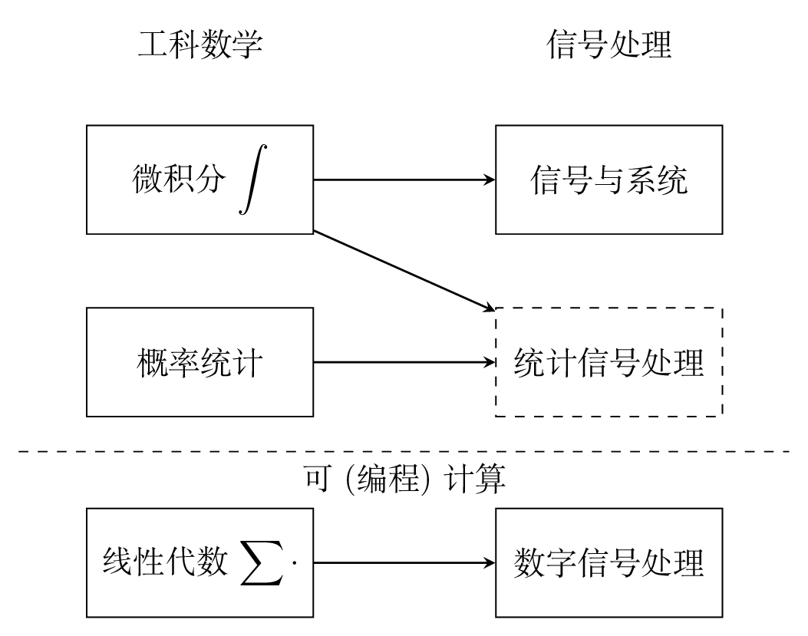

# Preface

For now, see https://chenshuo.com/data/DSP_Labs.ipynb for the notebook.

数字信号处理非常有用，近些年更有一些“出圈”的应用，比如 FFT 常作为机器学习特征提取的一种手段。
但是传统电子信息专业设置的学习路径太长，往往要先学《信号与系统》这门比较难的课，
这非常不利于非电子专业的人士自学。

我（陈硕）认为，就一般应用而言，对于非电子专业的学生，《数字信号处理》可以不必依赖于《信号与系统》，
而可以在学过基本的《线性代数》的基础上直接上手做实验。
先通过实验现象来感受数字信号处理的基本规律，有了感性认识之后，如果有进一步的需求，再去学理论。
这是因为《数字信号处理》和《线性代数》一样，是少数的“可计算 / compututable”的课程，
这里“可计算”指的是易于编程计算，知道数组和循环就可以实现大多数数字信号处理算法。
不管三七二十一，先写几行代码把公式算出个结果来，拿到结果数据，再来看它有什么名堂。
甚至可以说，《数字信号处理》只用加减乘，极少用到除法。
《数字信号处理》里用得最多的是向量点乘向量（内积），偶尔也用矩阵乘以向量，很少用矩阵乘以矩阵。
用 computer science 的话来说，涉及最多的是 BLAS 1，偶尔用到 BLAS 2，几乎用不到 BLAS 3。



另外，我感觉传统的《数字信号处理》教材的内容编排也不利于快速自学。
夸张一点说，就好比学开汽车。现在 5、6 岁的小朋友在游乐场就可以开动玩具电瓶车。
而我们的驾驶课程甚至不是从内燃机原理讲起，而是从石油的开采和提炼讲起。
这就是我读很多《数字信号处理》教材的感受：过于强调基础，丝毫不考虑读者的迫切应用需求，
而是

> 毫无重点地平铺直叙，不分轻重地陈述细节，往往在第三章以前就用无聊的细节谋杀了读者的热情。 —— 孟岩 https://blog.csdn.net/myan/article/details/5877305

这方面

```{tableofcontents}
```
